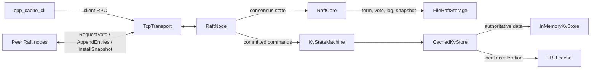

# cpp-cache

A thread-safe cache library and replicated key-value service based on Raft.

## Implemented Policies

- **LRU (Least Recently Used)**  
  O(1) operations using hash map + doubly-linked list.

- **LFU (Least Frequently Used)**  
  O(1) average complexity via frequency buckets and constant-time promotion.

- **ARC (Adaptive Replacement Cache)**  
  Adaptive recency/frequency balancing with bounded resident and ghost lists.

## Highlights

- Policy abstraction with interchangeable eviction strategies
- Thread-safe design with controlled synchronization scope
- Deterministic eviction behavior
- RAII-compliant memory management
- Clean separation between cache interface and replacement policy

## Replicated KV Architecture

The cache policies are local acceleration components. Authoritative data is
owned by an `IKvStore` implementation and is never removed by cache eviction.



- `InMemoryKvStore` provides a thread-safe in-memory authoritative store.
- `CachedKvStore` adds a bounded local LRU cache in front of any `IKvStore`.
- `KvStateMachine` applies deterministic put, append, and erase commands,
  rejects duplicate client requests within a bounded client window, and
  snapshots both data and deduplication state.
- `RaftCore` implements elections, log consistency, majority commit, conflict
  repair, persistence, and snapshot compaction/installation.
- `RaftNode` runs election and heartbeat timers, applies committed commands, and
  serves quorum-confirmed reads.
- `TcpTransport` provides bounded, length-prefixed Raft and client RPC over TCP.
- `FileRaftStorage` atomically replaces and synchronizes durable Raft state.

Cache metadata is intentionally excluded from snapshots and Raft logs.

## Known Boundaries

- Cluster membership is static; online membership changes are not supported.
- The TCP protocol has no authentication or encryption and should only be bound
  to trusted interfaces.
- All nodes replicate one complete key space; the service does not shard data
  across multiple Raft groups.
- Request deduplication tracks the 4096 most recently applied clients. Requests
  from an evicted client are no longer guaranteed to be recognized as retries.
- Each RPC opens a new TCP connection. Persistent peer connections and
  connection pooling are outside the current scope.
- Raft RPC uses a fixed-size blocking worker pool. Connections that stall while
  sending a frame can occupy workers until the socket timeout expires; the
  transport does not include slow-client protection or non-blocking I/O.

## Build and Test

```bash
cmake -S . -B build
cmake --build build
ctest --test-dir build --output-on-failure
```

## Reproducible Raft Benchmark

The benchmark exercises a three-node cluster in one process. Sequential write
throughput includes Raft replication, majority commit, state-machine apply, and
snapshot compaction. It uses `InProcessTransport` and `MemoryRaftStorage`, so it
does not claim TCP or disk-fsync throughput. Failover time starts when the
leader is isolated and ends when a replacement leader commits its first write.

```bash
cmake -S . -B build-release -DCMAKE_BUILD_TYPE=Release
cmake --build build-release --target raft_benchmark -j2
./build-release/raft_benchmark --operations 2000 --rounds 5 --failovers 7
```

Example result measured on 2026-08-21 in a local WSL2 environment with GCC
13.3.0:

| Metric | Samples | p50 | p95 |
| --- | ---: | ---: | ---: |
| Sequential committed writes | 5 x 2000 operations | 8,491 ops/s | 8,556 ops/s |
| Leader isolation to replacement write commit | 7 failovers | 444.54 ms | 564.64 ms |

Results depend on the host and scheduler. The executable prints every sample so
the summary can be checked rather than inferred from a single run.

## Run a Three-Node Cluster

Start each command in a separate terminal:

```bash
./build/cpp_cache_node --id 1 --listen 127.0.0.1:7001 \
  --peer 2=127.0.0.1:7002 --peer 3=127.0.0.1:7003 --data data/node1.raft

./build/cpp_cache_node --id 2 --listen 127.0.0.1:7002 \
  --peer 1=127.0.0.1:7001 --peer 3=127.0.0.1:7003 --data data/node2.raft

./build/cpp_cache_node --id 3 --listen 127.0.0.1:7003 \
  --peer 1=127.0.0.1:7001 --peer 2=127.0.0.1:7002 --data data/node3.raft
```

Use any node address; the CLI retries until it finds the leader:

```bash
SERVERS=127.0.0.1:7001,127.0.0.1:7002,127.0.0.1:7003
./build/cpp_cache_cli "$SERVERS" put greeting hello
./build/cpp_cache_cli "$SERVERS" append greeting '-raft'
./build/cpp_cache_cli "$SERVERS" get greeting
./build/cpp_cache_cli "$SERVERS" erase greeting
```
